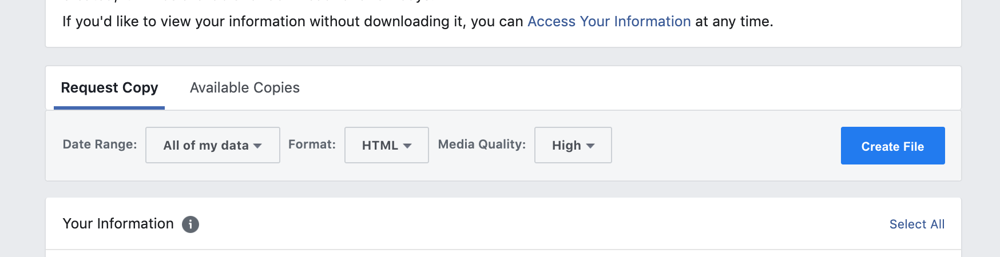
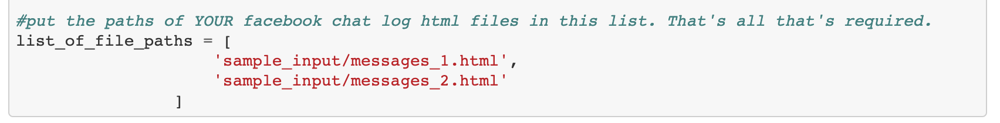
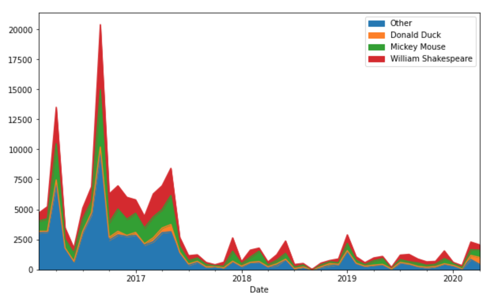
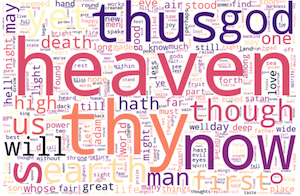

# Facebook Chat Analysis

Analyzes your Facebook group chat logs.

# How to use:

### 1) Download your Facebook chat history

Facebook has [instructions online](https://www.facebook.com/help/1701730696756992/?helpref=hc_fnav) about how to download your personal information as a .zip file. Basically, you create a file with the relevant information and then download it——in this case, we only need the messages, so no photos, status updates, etc:

### 2) Find the relevant chat or group chat, and move it to a separate folder. 

Once you extract the .zip file, it will be a list of folders of active and archived chats. Find the relevant chat folder, which will contain one or more .html files. Copy these all to a separate directory for simplicity.

### 3) Copy the paths to these files to the top of the fbchat_analysis jupyter notebook:

Put them in this list. If you don't the sample html files are just random lines from Milton's *Paradise Lost*, formatted as a Facebook chat.

### 4) Follow the instructions in the Jupyter notebook

And generate graphs like these:

